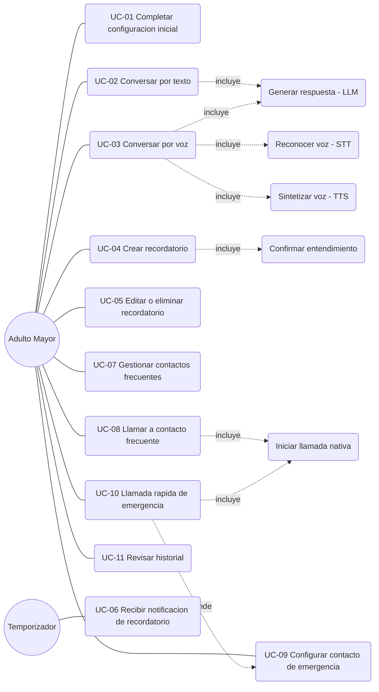

# JOTA AI — Use Cases

**Fecha:** 2026-07-20
**Autor:** José Antonio de la Cruz Portal
**Estado:** Borrador para aprobación
**Fuente:** `docs/02_FUNCTIONAL_REQUIREMENTS.md`, `docs/03_NON_FUNCTIONAL_REQUIREMENTS.md`
**Posición en el flujo de trabajo:** Documento 4 de 10

---

## 1. Propósito

Formalizar los flujos de interacción del usuario con JOTA como casos de uso, sirviendo de puente entre "qué debe hacer el sistema" (Functional Requirements) y "cómo se ve/siente esa interacción" (UX/UI Design, documento 5). Cada caso de uso referencia los requisitos que satisface, para mantener la trazabilidad iniciada en el documento 2.

## 2. Actores

| Actor | Tipo | Descripción |
|---|---|---|
| **Adulto mayor** | Primario, humano | Usuario final del sistema; interactúa por voz, texto y toques simples. |
| **Temporizador del sistema** | Secundario, no humano | Dispara notificaciones de recordatorios en el momento programado. |
| **Sistema operativo (Android)** | Secundario, no humano | Ejecuta llamadas nativas, gestiona permisos, entrega notificaciones. |
| **Contacto (frecuente o de emergencia)** | Externo, humano | Receptor de la llamada iniciada por el usuario; no interactúa con la app. |

## 3. Diagrama de casos de uso (representación textual)

## 4. Catálogo de casos de uso

| ID | Nombre | Actor primario | Prioridad | Requisitos relacionados |
|---|---|---|---|---|
| UC-01 | Completar configuración inicial | Adulto mayor | Must | FR-00.1, FR-00.2, FR-00.3, NFR-15 |
| UC-02 | Conversar por texto con JOTA | Adulto mayor | Must | FR-01.1, FR-01.3, FR-01.4, NFR-06, NFR-07 |
| UC-03 | Conversar por voz con JOTA | Adulto mayor | Must | FR-01.2, FR-01.3, FR-01.4, NFR-01, NFR-02, NFR-05, NFR-07 |
| UC-04 | Crear recordatorio | Adulto mayor | Must | FR-03.1, NFR-05, NFR-11 |
| UC-05 | Editar o eliminar recordatorio | Adulto mayor | Must | FR-03.2, NFR-11 |
| UC-06 | Recibir notificación de recordatorio | Temporizador del sistema | Should | FR-03.3 |
| UC-07 | Gestionar contactos frecuentes | Adulto mayor | Must | FR-04.1 |
| UC-08 | Llamar a un contacto frecuente | Adulto mayor | Should | FR-04.2, NFR-11 |
| UC-09 | Configurar/actualizar contacto de emergencia | Adulto mayor | Must | FR-05.1 |
| UC-10 | Llamada rápida de emergencia | Adulto mayor | Must | FR-05.2, NFR-11 |
| UC-11 | Revisar historial | Adulto mayor | Should/Could | FR-06.1, FR-06.2 |

---

## 5. Casos de uso detallados

### UC-01 — Completar configuración inicial

**Actor primario:** Adulto mayor
**Precondiciones:** Primera apertura de la app tras instalarla.
**Flujo principal:**
1. La app se abre y JOTA se presenta con un mensaje breve de bienvenida (voz + texto + avatar en estado feliz/esperando).
2. JOTA explica en lenguaje simple qué puede hacer (2-3 frases, no una lista técnica).
3. El sistema solicita el nombre del usuario.
4. El sistema solicita permisos uno a la vez (micrófono, contactos, llamadas), explicando el motivo de cada uno antes de la solicitud nativa del sistema operativo (NFR-15).
5. El sistema solicita configurar al menos un contacto de emergencia (ver UC-09), marcándolo como obligatorio para continuar.
6. El onboarding finaliza y el usuario llega a la pantalla principal con el avatar en estado "esperando".

**Flujos alternativos:**
- 4a. El usuario rechaza un permiso: el sistema explica qué funcionalidad quedará limitada sin ese permiso y permite continuar (no bloquea todo el onboarding, salvo el caso 5).
- 5a. El usuario no tiene ningún contacto para registrar como emergencia: el sistema permite posponerlo, pero muestra un recordatorio persistente (no bloqueante) hasta que se configure, dado que UC-10 depende de esto.

**Postcondiciones:** Usuario configurado, permisos gestionados, al menos intento de configuración de contacto de emergencia realizado.

---

### UC-02 — Conversar por texto con JOTA

**Actor primario:** Adulto mayor
**Precondiciones:** Onboarding completado (UC-01); conexión de red disponible hacia el backend.
**Flujo principal:**
1. El usuario escribe un mensaje en el campo de texto y confirma el envío.
2. El sistema muestra el mensaje del usuario en el hilo de conversación.
3. El avatar cambia a estado "pensando".
4. El sistema envía el mensaje al backend junto con el contexto de sesión (FR-01.3) y el backend genera una respuesta (LLM).
5. El sistema muestra la respuesta en el hilo de conversación y el avatar pasa a "hablando" y luego a "esperando".

**Flujos alternativos:**
- 4a. El backend no responde dentro del timeout (NFR-07): se muestra el mensaje de error amigable de FR-01.4; el avatar vuelve a "esperando".
- 1a. El usuario intenta enviar un mensaje vacío: el control de envío permanece inactivo.

**Postcondiciones:** El intercambio queda registrado en el historial de conversación (UC-11).

---

### UC-03 — Conversar por voz con JOTA

**Actor primario:** Adulto mayor
**Precondiciones:** Onboarding completado; permiso de micrófono concedido; conexión de red disponible.
**Flujo principal:**
1. El usuario activa el control de voz (botón simple, sin gestos complejos) y habla.
2. El sistema captura el audio y el avatar pasa a "escuchando".
3. Al detectar fin del habla, el sistema envía el audio a transcripción (STT) y el avatar pasa a "pensando".
4. El texto transcrito se envía al modelo de lenguaje junto con el contexto de sesión.
5. La respuesta generada se sintetiza en voz (TTS) y se reproduce mientras el avatar está en "hablando", sincronizado por amplitud de audio (FR-02.2).
6. Al finalizar la reproducción, el avatar vuelve a "esperando".

**Flujos alternativos:**
- 2a. El audio capturado es silencio o ruido no reconocible: el sistema informa amigablemente y pide repetir (FR-01.4).
- 3a. El tiempo total supera 1.5s antes de tener respuesta (NFR-01): el sistema emite una señal de "sigo aquí" (sonido breve o animación) para no dejar al usuario en silencio.
- 4a. El backend no responde dentro del timeout (NFR-07): mensaje de error amigable, igual que en UC-02.

**Postcondiciones:** El intercambio (transcripción + respuesta) queda registrado en el historial de conversación.

---

### UC-04 — Crear recordatorio

**Actor primario:** Adulto mayor
**Precondiciones:** Onboarding completado.
**Flujo principal:**
1. El usuario expresa la intención de crear un recordatorio, por voz/texto ("recuérdame tomar mi pastilla a las 3 de la tarde") o mediante un botón explícito "Nuevo recordatorio" en la pantalla de recordatorios.
2. El sistema extrae descripción y momento (fecha/hora) del mensaje, o los solicita mediante un formulario simple si el usuario usó el botón explícito.
3. El sistema muestra al usuario un resumen de lo entendido ("Recordatorio: tomar tu pastilla, hoy a las 3:00 p.m. ¿Es correcto?") y solicita confirmación de un toque.
4. El usuario confirma.
5. El sistema guarda el recordatorio y programa la notificación local (UC-06).

**Flujos alternativos:**
- 2a. La fecha/hora es ambigua o ya pasó: el sistema pide aclaración antes de mostrar el resumen del paso 3.
- 3a. El usuario indica que el resumen es incorrecto: el sistema permite corregir el campo específico sin reiniciar todo el flujo.

**Justificación de diseño:** El paso de confirmación explícita (3) existe por el riesgo de precisión de reconocimiento de voz documentado en NFR-05 — nunca se guarda un recordatorio de medicación sin que el usuario confirme lo entendido.

**Postcondiciones:** Recordatorio almacenado y notificación programada.

---

### UC-05 — Editar o eliminar recordatorio

**Actor primario:** Adulto mayor
**Precondiciones:** Existe al menos un recordatorio creado (UC-04).
**Flujo principal (editar):**
1. El usuario abre la lista de recordatorios.
2. El usuario selecciona un recordatorio y elige "Editar".
3. El usuario modifica el campo deseado y confirma.
4. El sistema actualiza el recordatorio y reprograma la notificación si el momento cambió.

**Flujo principal (eliminar):**
1. El usuario selecciona un recordatorio y elige "Eliminar".
2. El sistema solicita confirmación explícita de un toque (NFR-11, acción irreversible).
3. El usuario confirma y el sistema elimina el recordatorio y cancela su notificación.

**Postcondiciones:** Lista de recordatorios y notificaciones programadas quedan consistentes con la acción realizada.

---

### UC-06 — Recibir notificación de recordatorio

**Actor primario:** Temporizador del sistema (dispara el evento; el adulto mayor es receptor pasivo)
**Precondiciones:** Existe un recordatorio programado (UC-04).
**Flujo principal:**
1. Llega el momento programado del recordatorio.
2. El sistema operativo entrega una notificación local con el texto del recordatorio en lenguaje simple (FR-03.3).
3. El usuario puede tocar la notificación para abrir la app en el contexto correspondiente, o descartarla.

**Flujos alternativos:**
- 3a. El usuario no interactúa con la notificación: queda registrada en el historial de acciones (UC-11) como "recordatorio entregado", sin forzar confirmación de lectura en el MVP.

**Postcondiciones:** Notificación entregada; evento registrado en historial de acciones.

---

### UC-07 — Gestionar contactos frecuentes

**Actor primario:** Adulto mayor
**Precondiciones:** Onboarding completado; permiso de contactos concedido (si se importa desde la agenda nativa) o registro manual disponible.
**Flujo principal:**
1. El usuario abre la lista de contactos frecuentes.
2. El usuario agrega un contacto (manualmente o importado de la agenda nativa), o edita/elimina uno existente.
3. El sistema guarda el cambio y lo refleja de inmediato en la lista.

**Postcondiciones:** Lista de contactos frecuentes actualizada.

---

### UC-08 — Llamar a un contacto frecuente

**Actor primario:** Adulto mayor
**Precondiciones:** Existe al menos un contacto frecuente (UC-07); permiso de llamadas concedido.
**Flujo principal:**
1. El usuario pide a JOTA, por voz o texto, llamar a un contacto ("llama a María").
2. El sistema identifica el contacto por nombre entre los contactos frecuentes y muestra una confirmación ("¿Llamar a María González?").
3. El usuario confirma con un toque.
4. El sistema inicia la llamada nativa del sistema operativo.

**Flujos alternativos:**
- 2a. Ningún contacto frecuente coincide con el nombre mencionado: el sistema informa que no encontró el contacto y sugiere revisar la lista (UC-07), sin intentar adivinar.
- 2b. Más de un contacto coincide parcialmente: el sistema pide precisar cuál (mostrando opciones, no lista larga).

**Postcondiciones:** Llamada nativa iniciada (o el usuario redirigido a gestionar contactos si no se encontró coincidencia).

---

### UC-09 — Configurar/actualizar contacto de emergencia

**Actor primario:** Adulto mayor
**Precondiciones:** Ninguna (puede ejecutarse durante el onboarding — UC-01 — o después, desde configuración).
**Flujo principal:**
1. El usuario accede a la sección de contacto de emergencia (desde onboarding o configuración).
2. El usuario ingresa nombre y número del contacto de emergencia.
3. El sistema guarda el contacto y lo marca como el destino de la llamada rápida de emergencia (UC-10).

**Flujos alternativos:**
- 3a. El usuario ya tenía un contacto de emergencia configurado: el nuevo reemplaza al anterior tras confirmación explícita.

**Postcondiciones:** Existe un contacto de emergencia válido asociado al botón de llamada rápida.

---

### UC-10 — Llamada rápida de emergencia

**Actor primario:** Adulto mayor
**Precondiciones:** Existe un contacto de emergencia configurado (UC-09).
**Flujo principal:**
1. Desde la pantalla principal, el usuario activa el control de emergencia (siempre visible, sin necesidad de navegar).
2. El sistema solicita una única confirmación de un toque ("¿Llamar a [contacto de emergencia] ahora?").
3. El usuario confirma.
4. El sistema inicia la llamada nativa de inmediato.

**Flujos alternativos:**
- 1a. No hay contacto de emergencia configurado: el sistema no permite continuar con la llamada y redirige de inmediato a UC-09, explicando por qué.

**Restricción explícita de diseño:** Este caso de uso **no** incluye detección automática de emergencias (caídas, pánico en la voz, etc.) — es una acción directa e intencional del usuario, según lo acordado en el Vision Document, sección 7.

**Postcondiciones:** Llamada nativa iniciada al contacto de emergencia.

---

### UC-11 — Revisar historial

**Actor primario:** Adulto mayor
**Precondiciones:** Existen conversaciones y/o acciones previas registradas.
**Flujo principal:**
1. El usuario abre la sección de historial.
2. El sistema muestra una lista de conversaciones pasadas ordenadas por fecha (FR-06.1).
3. El usuario selecciona una conversación y ve su contenido completo.

**Flujo alternativo (historial de acciones, prioridad Could):**
- 2a. El usuario cambia a la vista de "acciones realizadas" y ve un registro de recordatorios creados, llamadas iniciadas, etc. (FR-06.2).

**Postcondiciones:** Ninguna modificación de datos; es una vista de solo lectura.

---

## 6. Notas de diseño derivadas (a considerar en UX/UI Design)

1. **Confirmación de entendimiento como patrón recurrente:** UC-04 y UC-08 comparten el patrón "mostrar lo entendido antes de actuar" — esto debería ser un componente de UI reutilizable (p. ej. un `ConfirmationCard`), no una implementación ad-hoc por pantalla.
2. **El botón de emergencia debe ser un elemento de navegación global**, visible desde cualquier pantalla principal, no enterrado en un menú (impacto directo en UC-10 y en NFR-11).
3. **El onboarding (UC-01) es la única pantalla que "obliga" una acción** (configurar contacto de emergencia) — el resto de la experiencia debe evitar bloqueos similares para no generar frustración.
4. **La señal de "sigo aquí" de UC-03** (alternate flow 3a) es un requisito de UX tan importante como el pipeline técnico de voz — debe diseñarse explícitamente como parte del documento 5, no dejarse como detalle de implementación.

---

## 7. Aprobación y siguiente paso

Estos casos de uso son la base directa para los wireframes y flujos de pantalla del documento 5. Cualquier pantalla propuesta en UX/UI Design debe poder trazarse a al menos un caso de uso de este documento.

**Próximo documento:** `05_UX_UI_DESIGN.md`
