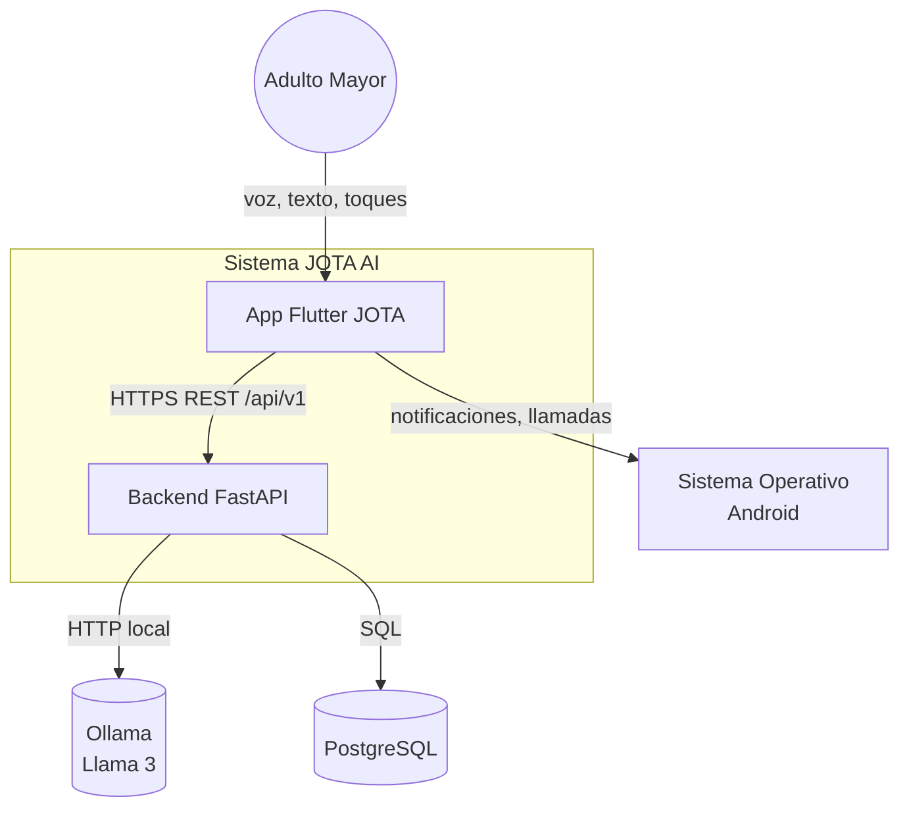
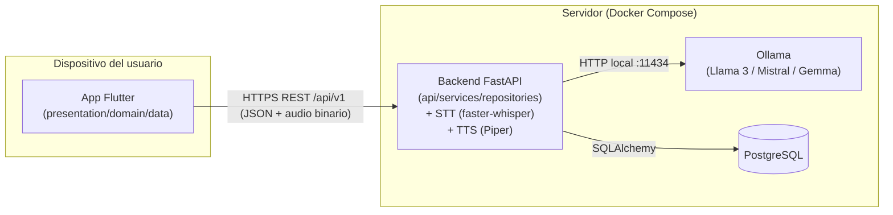
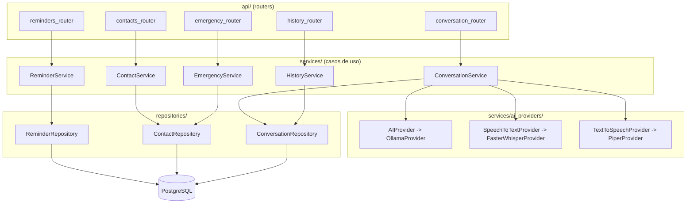
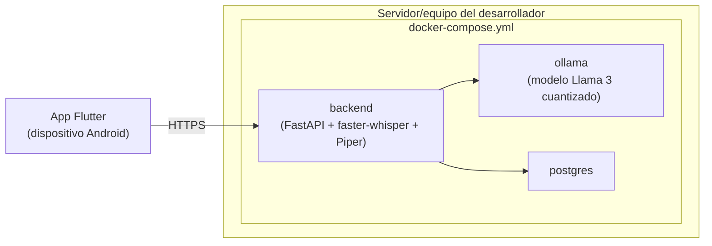

# JOTA AI — System Architecture

**Fecha:** 2026-07-20
**Autor:** José Antonio de la Cruz Portal
**Estado:** Borrador para aprobación
**Fuente:** `docs/05_UX_UI_DESIGN.md`, `docs/03_NON_FUNCTIONAL_REQUIREMENTS.md`, `CLAUDE.md`
**Posición en el flujo de trabajo:** Documento 6 de 10

---

## 1. Propósito

Definir la arquitectura técnica completa del sistema: cómo se dividen sus partes, cómo se comunican, y por qué. Este documento traduce las restricciones ya fijadas (presupuesto bajo, un solo desarrollador, latencia ≤3s, sustitución de proveedor de IA) en decisiones de arquitectura concretas y justificadas.

**Regla de trazabilidad:** toda decisión aquí debe poder justificarse contra un requisito de `docs/03_NON_FUNCTIONAL_REQUIREMENTS.md` o una restricción de `CLAUDE.md`.

---

## 2. Vista de contexto (nivel más alto)



**Decisión clave:** Whisper (STT) y Piper (TTS) **no** aparecen como sistemas externos independientes en esta vista — se ejecutan como librerías embebidas dentro del proceso del backend (ver sección 4, justificación en 4.3). Ollama sí se mantiene como servicio HTTP separado porque expone su propia API y gestiona el ciclo de vida del modelo (carga en memoria/GPU) de forma independiente.

---

## 3. Vista de contenedores



| Contenedor | Responsabilidad | Justificación |
|---|---|---|
| **App Flutter** | UI, avatar, captura de voz, reproducción TTS, navegación (GoRouter) | Cliente único, ya definido en `CLAUDE.md` |
| **Backend FastAPI** | Orquestación de conversación, STT, TTS, lógica de dominio (recordatorios, contactos, emergencia, historial), persistencia | Monolito modular — ver sección 4.2 |
| **Ollama** | Servir el modelo de lenguaje (Llama 3 u otro) vía API HTTP local | Desacoplado para poder cambiar de modelo/tamaño sin tocar el backend |
| **PostgreSQL** | Persistencia de usuarios, recordatorios, contactos, historial | Requisito de `CLAUDE.md`; relacional, adecuado para datos estructurados con relaciones simples |

---

## 4. Decisiones de arquitectura

### 4.1 Clean Architecture en ambos lados

**Flutter (`features/{feature}/presentation|domain|data`, `core/`, `shared/`):**
- `presentation`: widgets, controladores de estado (Riverpod), navegación.
- `domain`: entidades y casos de uso puros (sin dependencia de Flutter ni de paquetes de red).
- `data`: implementaciones de repositorios, clientes HTTP, mapeo de DTOs.

**FastAPI (`api/`, `services/`, `repositories/`, `models/`, `schemas/`, `database/`):**
- `api`: routers, validación de entrada/salida (Pydantic schemas), sin lógica de negocio.
- `services`: casos de uso / lógica de aplicación (orquesta repositorios y providers de IA).
- `repositories`: acceso a datos vía SQLAlchemy, implementando interfaces definidas en la capa de servicios.
- `models`: entidades SQLAlchemy.
- `schemas`: contratos Pydantic de entrada/salida de la API.

Esta separación es la que permite cumplir **NFR-20** (conformidad arquitectónica) y **NFR-23** (sustitución de proveedor de IA sin tocar dominio).

### 4.2 Monolito modular, no microservicios

**Decisión:** un único servicio FastAPI con módulos internos bien separados por feature (`conversation/`, `reminders/`, `contacts/`, `emergency/`, `history/`), en vez de servicios independientes desplegados por separado.
**Justificación:** un solo desarrollador no puede operar la complejidad operativa de microservicios (múltiples despliegues, descubrimiento de servicios, versionado cruzado) sin beneficio real a esta escala. Ya recomendado en `ANALISIS_ARQUITECTONICO.md`, sección 5.
**Camino de escalabilidad futura:** si el proyecto creciera post-tesis, cada módulo ya está desacoplado internamente por interfaces, lo que facilita extraerlo a un servicio propio si fuera necesario (YAGNI aplicado correctamente: la capacidad de separar existe en el diseño, pero no se construye la infraestructura hasta que se necesite).

### 4.3 STT y TTS embebidos en el backend, no como microservicios separados

**Decisión:** Whisper (vía `faster-whisper`) y Piper se invocan como librerías Python dentro del proceso del backend, no como servicios HTTP independientes.
**Justificación:** evita un salto de red adicional por cada turno de conversación (impacto directo en el presupuesto de latencia de **NFR-01/NFR-02**), y reduce la superficie operativa (menos contenedores que mantener con presupuesto y tiempo limitados).
**Trade-off aceptado:** el backend queda acoplado al ciclo de vida de estos modelos (tiempo de carga en memoria al iniciar). Se documenta como ADR (ver sección 8).

### 4.4 Comunicación cliente-servidor: HTTP síncrono, no WebSocket, en el MVP

**Decisión:** el turno de voz completo (`POST /api/v1/conversation/voice-turn`) es una única petición HTTP: la app envía el audio grabado, el backend ejecuta STT → LLM → TTS internamente y devuelve texto + audio de respuesta en una sola respuesta.
**Justificación:** cumple el principio de "evitar complejidad injustificada" de `CLAUDE.md`. Streaming/WebSocket reduciría la latencia percibida (respuesta parcial mientras se genera) pero añade complejidad de manejo de estado en ambos lados que no se justifica para validar el MVP de tesis, siempre que el presupuesto de latencia de NFR-01 (≤3s) se cumpla con el enfoque síncrono.
**Camino de escalabilidad futura:** si las pruebas de latencia (NFR-01) muestran que el enfoque síncrono no alcanza el umbral, la siguiente iteración migra este único endpoint a streaming (WebSocket o Server-Sent Events) sin afectar el resto de la arquitectura — es un cambio aislado a la capa `api`.

### 4.5 Abstracción del proveedor de IA (cumple NFR-23)

**Patrón:** Strategy/Adapter, con interfaces definidas en la capa `services`:

```python
class AIProvider(Protocol):
    async def generate_response(self, context: ConversationContext) -> str: ...

class SpeechToTextProvider(Protocol):
    async def transcribe(self, audio: bytes) -> str: ...

class TextToSpeechProvider(Protocol):
    async def synthesize(self, text: str) -> bytes: ...
```

**Implementaciones MVP:** `OllamaProvider`, `FasterWhisperProvider`, `PiperProvider`.
**Implementaciones futuras (sin tocar dominio):** `OpenAIProvider`, `MistralProvider`, `GemmaProvider` (vía Ollama, cambiando solo configuración), otro STT/TTS en la nube.
**Inyección de dependencias:** FastAPI `Depends()` selecciona la implementación concreta según configuración (variable de entorno), nunca mediante `if/else` esparcido en la lógica de negocio.

### 4.6 Autenticación y sesión

**Decisión MVP:** un token de dispositivo simple (generado en el primer onboarding, almacenado localmente) en vez de un sistema de autenticación completo con usuario/contraseña.
**Justificación:** el Vision Document pospone perfiles múltiples; un solo adulto mayor por dispositivo no requiere login tradicional (barrera de accesibilidad innecesaria). El token identifica al dispositivo/usuario ante el backend para asociar recordatorios, contactos e historial.
**Seguridad:** el token viaja siempre sobre HTTPS (NFR-12); no reemplaza cifrado, solo identifica la sesión.

---

## 5. Vista de componentes — Backend



---

## 6. Vista de componentes — Flutter

```text
lib/
├── core/
│   ├── network/          # cliente HTTP (Dio/http), interceptores, manejo de errores
│   ├── theme/             # design tokens del documento 5 (tipografia, color, espaciado)
│   ├── router/            # configuracion de GoRouter (rutas del documento 5, seccion 4)
│   └── avatar/            # controlador de estado del avatar (idle/escuchando/pensando/hablando)
├── shared/
│   └── widgets/           # ConfirmationCard, EmergencyButton, LatencyIndicator, VoiceInputButton
├── features/
│   ├── onboarding/
│   │   ├── presentation/
│   │   ├── domain/
│   │   └── data/
│   ├── conversation/
│   │   ├── presentation/  # ChatScreen, HomeScreen (usa AvatarWidget)
│   │   ├── domain/        # SendTextMessage, SendVoiceMessage (casos de uso)
│   │   └── data/          # ConversationRepositoryImpl (llama a core/network)
│   ├── reminders/
│   │   ├── presentation/
│   │   ├── domain/
│   │   └── data/
│   ├── contacts/
│   │   ├── presentation/
│   │   ├── domain/
│   │   └── data/
│   ├── emergency/
│   │   ├── presentation/
│   │   ├── domain/
│   │   └── data/
│   └── history/
│       ├── presentation/
│       ├── domain/
│       └── data/
```

**Gestión de estado:** Riverpod (`Provider`, `StateNotifierProvider` o `AsyncNotifierProvider` según corresponda) por feature, sin estado global compartido salvo el controlador del avatar (`core/avatar`), que es consumido por múltiples features (conversación, recordatorios al confirmar, emergencia al confirmar).

---

## 7. Vista de despliegue (Docker Compose, entorno de tesis)



**Nota:** en este entorno de tesis, HTTPS puede resolverse con un proxy simple (p. ej. Caddy con certificado local o túnel como ngrok/Cloudflare Tunnel durante pruebas) para no romper NFR-12 incluso en desarrollo.

---

## 8. Registro de decisiones arquitectónicas (ADR) a documentar

Conforme a **NFR-22**, las siguientes decisiones de este documento deben registrarse como ADR individuales en `docs/adr/` antes de iniciar el desarrollo:

1. ADR-001: Monolito modular vs. microservicios.
2. ADR-002: STT/TTS embebidos en el backend vs. servicios independientes.
3. ADR-003: Comunicación HTTP síncrona vs. WebSocket para el turno de voz.
4. ADR-004: Abstracción `AIProvider` mediante patrón Strategy/Adapter.
5. ADR-005: Token de dispositivo vs. autenticación tradicional.

---

## 9. Aprobación y siguiente paso

Esta arquitectura es la base directa para el diseño detallado del pipeline conversacional (documento 7) y el esquema de base de datos (documento 8).

**Próximo documento:** `07_AI_ARCHITECTURE.md`
