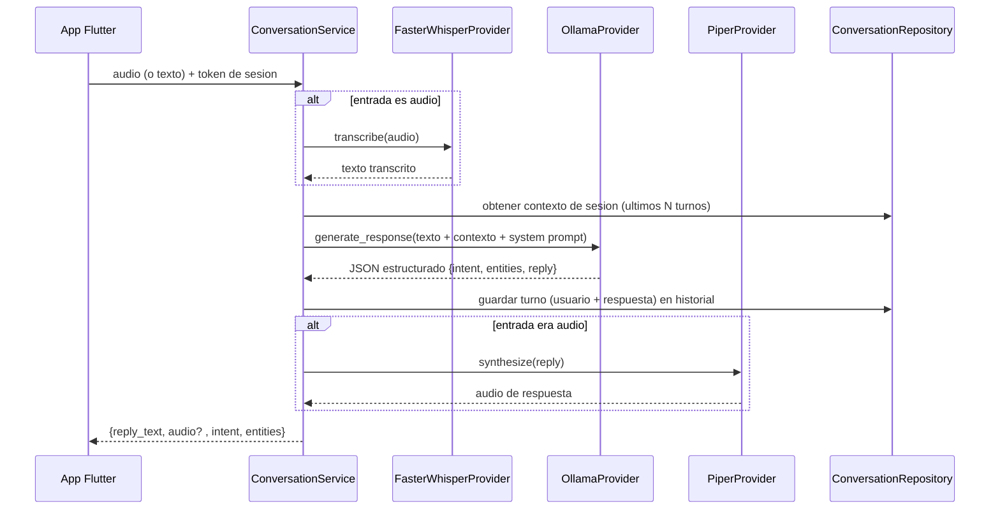
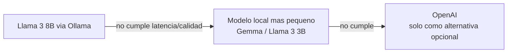

# JOTA AI — AI Architecture

**Fecha:** 2026-07-20
**Autor:** José Antonio de la Cruz Portal
**Estado:** Borrador para aprobación
**Fuente:** `docs/06_SYSTEM_ARCHITECTURE.md` (sección 4.5, `AIProvider`), `docs/03_NON_FUNCTIONAL_REQUIREMENTS.md` (NFR-01, NFR-05, NFR-06, NFR-07), `docs/JOTA_AI_CONTEXT.md` (personalidad de JOTA)
**Posición en el flujo de trabajo:** Documento 7 de 10

---

## 1. Propósito

Diseñar el pipeline conversacional completo: cómo se orquestan STT, LLM y TTS dentro de `ConversationService`, cómo el modelo de lenguaje entiende tanto conversación libre como intenciones de acción (crear recordatorio, llamar a un contacto), y cómo se degrada el sistema ante fallos, dentro del presupuesto de latencia ya fijado (NFR-01: ≤3s).

---

## 2. Pipeline conversacional — vista general



**Decisión central:** una única llamada al LLM por turno resuelve **tanto** la comprensión de intención **como** la generación de la respuesta conversacional, evitando una segunda llamada al modelo solo para clasificar intención (ver sección 4). Esto es crítico para cumplir NFR-01 con un solo desarrollador y sin presupuesto para infraestructura adicional.

---

## 3. Personalidad y system prompt de JOTA

### 3.1 Rasgos obligatorios (de `docs/JOTA_AI_CONTEXT.md`)
Paciente, amigable, respetuoso, claro al explicar, empático, confiable, profesional. Nunca lenguaje técnico complejo. No debe comportarse como un chatbot genérico (`CLAUDE.md`).

### 3.2 Plantilla de system prompt (referencia inicial, a refinar empíricamente)

```
Eres JOTA, un asistente de voz que ayuda a personas adultas mayores a usar su
teléfono y organizar su día a día. Tu tono es paciente, cálido y respetuoso,
nunca infantilizante. Hablas en español sencillo, sin tecnicismos, con
oraciones cortas.

Reglas:
- Si el usuario te pide crear un recordatorio, identifica la descripcion y el
  momento (fecha/hora). Si falta informacion, pregunta antes de continuar.
- Si el usuario te pide llamar a alguien, identifica el nombre mencionado.
- Si no detectas ninguna accion, simplemente conversa de forma natural.
- Nunca inventes que ya realizaste una accion: solo el sistema, tras
  confirmacion del usuario, la ejecuta.
- Si no entiendes algo, dilo con calma y pide que lo repitan, sin usar
  palabras como "error" o "no reconocido".

Responde SIEMPRE en el siguiente formato JSON, sin texto fuera del JSON:
{
  "intent": "chat" | "create_reminder" | "call_contact" | "none",
  "entities": { ... },
  "reply": "texto natural que se le mostrara y dira al usuario"
}
```

**Justificación del formato JSON de salida:** permite que `ConversationService` enrute la intención detectada hacia el flujo de confirmación correspondiente (UC-04, UC-08) sin necesidad de un segundo modelo de clasificación, cumpliendo el principio de simplicidad de `CLAUDE.md`.

**Regla de seguridad de diseño:** el `intent` detectado por el LLM **nunca** ejecuta la acción directamente — siempre pasa por el `ConfirmationCard` (documento 5, sección 6.2) del lado de la app antes de que el backend la persista. El LLM propone, el usuario confirma, el backend ejecuta.

### 3.3 Manejo de salida no conforme

Si la respuesta del modelo no es un JSON válido (riesgo real con modelos pequeños cuantizados), `ConversationService` aplica una degradación controlada:
1. Intentar extraer el JSON con una expresión tolerante a texto adicional.
2. Si falla, tratar toda la salida como `intent: "chat"` y `reply` = el texto completo devuelto por el modelo.
3. Registrar el evento como métrica interna (tasa de fallos de formato), relevante para NFR-06.

---

## 4. Manejo de contexto de sesión

- **Alcance:** contexto de los **últimos N turnos** de la sesión activa (N inicial propuesto: 6 turnos / ~3 intercambios), sin memoria persistente entre sesiones (fuera de alcance, Vision Document sección 7).
- **Almacenamiento:** el historial completo se persiste en PostgreSQL (para UC-11, revisión de historial), pero solo los últimos N turnos se incluyen en el prompt enviado al LLM, para mantener el tamaño de contexto pequeño y la latencia baja (NFR-02).
- **Estructura del contexto enviado al modelo:**

```json
{
  "system_prompt": "...",
  "history": [
    {"role": "user", "text": "..."},
    {"role": "assistant", "reply": "..."}
  ],
  "current_message": "..."
}
```

---

## 5. Selección y configuración del modelo de lenguaje

| Parámetro | Valor inicial propuesto | Justificación |
|---|---|---|
| Modelo | Llama 3 8B, cuantizado (Q4_K_M) vía Ollama | Balance entre calidad de respuesta y viabilidad en hardware sin GPU dedicada |
| `temperature` | 0.4 | Respuestas consistentes y predecibles; evita divagaciones para un asistente de asistencia práctica |
| `max_tokens` (respuesta) | ~150 | Respuestas cortas por diseño (UX de voz — nadie quiere un párrafo largo hablado) |
| Keep-alive del modelo en Ollama | Mantener el modelo cargado en memoria entre solicitudes | Evita el costo de carga en frío (varios segundos) en cada turno, crítico para NFR-01 |

**Validación obligatoria antes de comprometerse:** medir tiempo real de generación en el hardware disponible del autor **antes** de fijar el tamaño de modelo definitivo (riesgo técnico #2 de `ANALISIS_ARQUITECTONICO.md`). Si Llama 3 8B no cumple NFR-01/NFR-02, siguiente alternativa: un modelo más pequeño (p. ej. Llama 3.2 3B o Gemma 2B) antes de descartar la ejecución local.

### 5.1 Estrategia de fallback de proveedor



Consistente con `CLAUDE.md`: OpenAI es opcional y de último recurso, nunca la opción por defecto, dado el requisito de presupuesto extremadamente bajo.

---

## 6. Pipeline de voz — detalles técnicos

### 6.1 Captura de audio y detección de fin de habla
- Grabación en el dispositivo hasta detectar silencio sostenido (Voice Activity Detection simple del lado del cliente, o un botón de "mantener presionado para hablar / soltar para enviar" como alternativa más simple y confiable de implementar por un solo desarrollador).
- **Recomendación para el MVP:** usar el patrón "mantener presionado para hablar" en vez de VAD automático — elimina un componente de incertidumbre técnica adicional (falsos cortes de audio) sin sacrificar usabilidad para el público objetivo, que de todas formas necesita una acción táctil explícita (alineado con `VoiceInputButton`, documento 5).

### 6.2 Speech-to-Text (`FasterWhisperProvider`)
- Modelo: Whisper `small` o `base` (a validar contra NFR-05, WER ≤20%), ejecutado vía `faster-whisper` (más eficiente en CPU que la implementación original de OpenAI).
- Idioma fijado a español (`language="es"`) para evitar el costo de detección automática de idioma.

### 6.3 Text-to-Speech (`PiperProvider`)
- Voz en español neutro/latino disponible en los modelos pre-entrenados de Piper.
- Salida en un formato de audio ligero (p. ej. WAV/OGG) optimizado para reproducción inmediata en Flutter.
- **Nota de diseño heredada del documento 5:** no se generan visemas ni marcas de tiempo por fonema — la sincronización del avatar usa la amplitud del audio ya generado (FR-02.2), evitando la complejidad de lip-sync real.

---

## 7. Manejo de fallos y timeouts (cumple NFR-07)

| Fallo | Comportamiento |
|---|---|
| STT no transcribe nada (audio vacío/ruido) | Respuesta inmediata sin llamar al LLM: "No pude escucharte bien, ¿puedes repetir?" |
| LLM no responde dentro de 6s | Se aborta la espera, se muestra el mensaje de error amigable de FR-01.4 |
| Salida del LLM no es JSON válido | Degradación descrita en sección 3.3 (se trata como chat plano) |
| TTS falla al sintetizar | Se muestra la respuesta en texto igualmente; el fallo de audio no bloquea la respuesta visible |
| Ollama no disponible (servicio caído) | `ConversationService` captura la excepción de conexión y responde con el mensaje de error de NFR-19, sin exponer detalles técnicos al usuario |

---

## 8. Consideraciones de seguridad y privacidad en el pipeline

- El audio crudo capturado se envía al backend solo para transcripción y se descarta inmediatamente después (NFR-13) — no se reenvía a ningún servicio de terceros.
- El prompt enviado al LLM incluye únicamente el contexto de sesión necesario (sección 4), nunca el historial completo ni datos de otros usuarios.
- Si en el futuro se habilita OpenAI como alternativa (sección 5.1), debe evaluarse cuidadosamente qué datos salen del entorno local, dado que ya no aplicaría el mismo nivel de control que con Ollama (a documentar como ADR adicional si llegara a activarse).

---

## 9. ADR adicionales identificados en este documento

6. ADR-006: Intención y respuesta en una sola llamada LLM (JSON estructurado) vs. clasificador de intención separado.
7. ADR-007: "Mantener presionado para hablar" vs. detección automática de fin de habla (VAD).

---

## 10. Aprobación y siguiente paso

El formato de contexto (sección 4) y las entidades mencionadas en `intent`/`entities` (recordatorio, contacto) determinan directamente los campos necesarios en el esquema de base de datos.

**Próximo documento:** `08_DATABASE_DESIGN.md`
