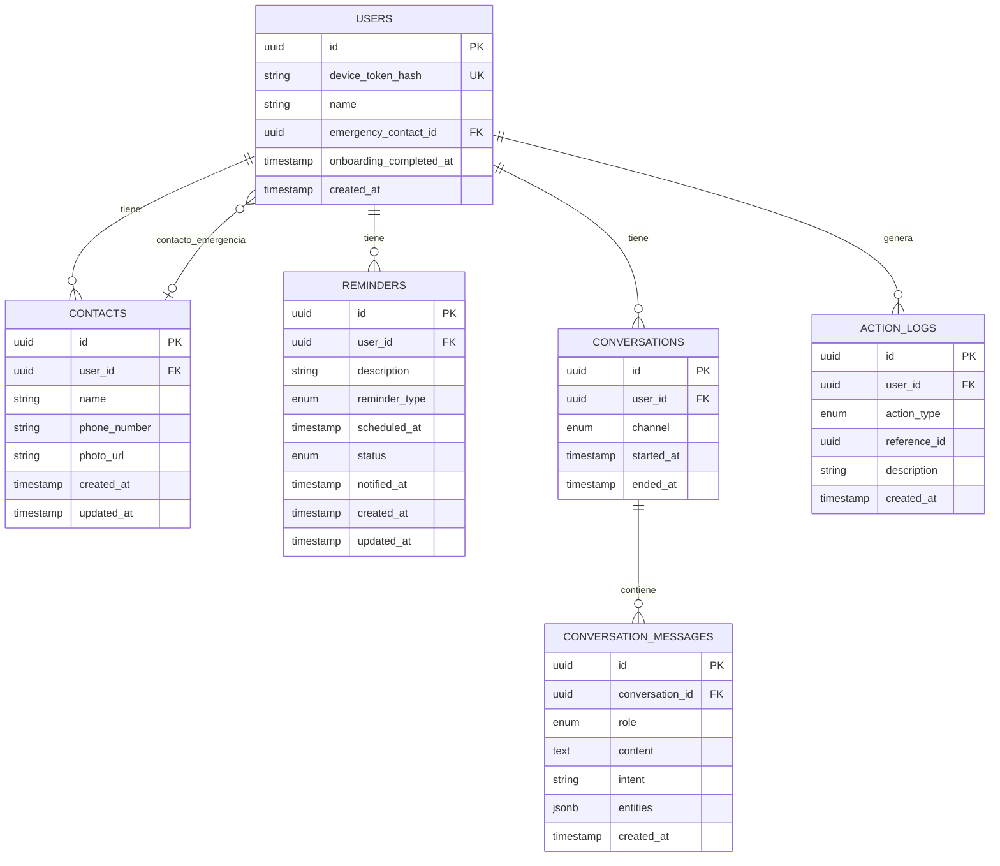

# JOTA AI — Database Design

**Fecha:** 2026-07-20
**Autor:** José Antonio de la Cruz Portal
**Estado:** Borrador para aprobación
**Fuente:** `docs/04_USE_CASES.md`, `docs/07_AI_ARCHITECTURE.md` (sección 4, entidades `intent`/`entities`), `docs/03_NON_FUNCTIONAL_REQUIREMENTS.md` (NFR-13, NFR-14)
**Posición en el flujo de trabajo:** Documento 8 de 10

---

## 1. Propósito

Definir el esquema de PostgreSQL que soporta el MVP: usuarios (dispositivo), recordatorios, contactos, conversaciones/mensajes e historial de acciones. Cada tabla se deriva directamente de un caso de uso o de una entidad ya mencionada en el pipeline de IA — no se agregan tablas especulativas.

---

## 2. Diagrama entidad-relación

---

## 3. Especificación de tablas

### 3.1 `users`
| Columna | Tipo | Restricciones | Notas |
|---|---|---|---|
| `id` | UUID | PK, default `gen_random_uuid()` | |
| `device_token_hash` | VARCHAR(128) | UNIQUE, NOT NULL | Hash del token de dispositivo (sección 4.6 de `06_SYSTEM_ARCHITECTURE.md`); el token en claro nunca se persiste |
| `name` | VARCHAR(100) | NOT NULL | Capturado en onboarding (UC-01) |
| `emergency_contact_id` | UUID | FK → `contacts.id`, NULL, `ON DELETE SET NULL` | Cumple UC-09 (un solo contacto de emergencia activo) |
| `onboarding_completed_at` | TIMESTAMP | NULL | NULL hasta completar UC-01 |
| `created_at` | TIMESTAMP | NOT NULL, default now() | |

**Nota de diseño:** un solo contacto de emergencia se modela como FK en `users`, no como un booleano `is_emergency` en `contacts`, porque UC-09 establece que el nuevo contacto **reemplaza** al anterior — una FK nullable expresa esa regla de negocio directamente en el esquema, sin necesidad de un índice único parcial.

### 3.2 `contacts`
| Columna | Tipo | Restricciones | Notas |
|---|---|---|---|
| `id` | UUID | PK | |
| `user_id` | UUID | FK → `users.id`, NOT NULL, `ON DELETE CASCADE` | |
| `name` | VARCHAR(100) | NOT NULL | |
| `phone_number` | VARCHAR(20) | NOT NULL | Formato E.164 recomendado |
| `photo_url` | TEXT | NULL | Opcional (FR-04.1) |
| `created_at` / `updated_at` | TIMESTAMP | NOT NULL | |

**Índice:** `idx_contacts_user_id` sobre `user_id` (listar contactos frecuentes de un usuario — UC-07).

### 3.3 `reminders`
| Columna | Tipo | Restricciones | Notas |
|---|---|---|---|
| `id` | UUID | PK | |
| `user_id` | UUID | FK → `users.id`, NOT NULL, `ON DELETE CASCADE` | |
| `description` | VARCHAR(280) | NOT NULL | Texto libre confirmado por el usuario (UC-04) |
| `reminder_type` | ENUM (`medication`, `event`, `activity`) | NOT NULL | Refleja las categorías de FR-03.1 |
| `scheduled_at` | TIMESTAMP | NOT NULL | Momento programado |
| `status` | ENUM (`pending`, `completed`, `cancelled`) | NOT NULL, default `pending` | |
| `notified_at` | TIMESTAMP | NULL | Se completa cuando se dispara UC-06 |
| `created_at` / `updated_at` | TIMESTAMP | NOT NULL | |

**Índice:** `idx_reminders_user_scheduled` sobre (`user_id`, `scheduled_at`) — soporta tanto la lista ordenada (UC-05) como la consulta del temporizador para notificaciones pendientes (UC-06).

### 3.4 `conversations`
| Columna | Tipo | Restricciones | Notas |
|---|---|---|---|
| `id` | UUID | PK | |
| `user_id` | UUID | FK → `users.id`, NOT NULL, `ON DELETE CASCADE` | |
| `channel` | ENUM (`text`, `voice`, `mixed`) | NOT NULL | Con fines de análisis de uso, no afecta lógica de negocio |
| `started_at` | TIMESTAMP | NOT NULL, default now() | |
| `ended_at` | TIMESTAMP | NULL | Se completa por inactividad (regla de aplicación, no de base de datos) |

**Índice:** `idx_conversations_user_started` sobre (`user_id`, `started_at` DESC) — soporta UC-11 (lista ordenada por fecha).

### 3.5 `conversation_messages`
| Columna | Tipo | Restricciones | Notas |
|---|---|---|---|
| `id` | UUID | PK | |
| `conversation_id` | UUID | FK → `conversations.id`, NOT NULL, `ON DELETE CASCADE` | |
| `role` | ENUM (`user`, `assistant`) | NOT NULL | |
| `content` | TEXT | NOT NULL | Texto del mensaje (transcrito si vino por voz) |
| `intent` | VARCHAR(30) | NULL | Solo en mensajes `assistant`; valor del campo `intent` del documento 7 |
| `entities` | JSONB | NULL | Entidades extraídas por el LLM (documento 7, sección 3.2); trazabilidad/depuración, no fuente de verdad de negocio |
| `created_at` | TIMESTAMP | NOT NULL, default now() | |

**Índice:** `idx_messages_conversation_created` sobre (`conversation_id`, `created_at`).
**Nota de privacidad (NFR-13):** no se almacena el audio crudo del usuario ni el audio sintetizado de JOTA — solo el texto. El campo `entities` no debe usarse para volver a ejecutar acciones automáticamente; es únicamente registro histórico.

### 3.6 `action_logs`
| Columna | Tipo | Restricciones | Notas |
|---|---|---|---|
| `id` | UUID | PK | |
| `user_id` | UUID | FK → `users.id`, NOT NULL, `ON DELETE CASCADE` | |
| `action_type` | ENUM (`reminder_created`, `reminder_updated`, `reminder_deleted`, `reminder_notified`, `contact_created`, `contact_updated`, `contact_deleted`, `contact_called`, `emergency_called`) | NOT NULL | |
| `reference_id` | UUID | NULL | Apunta al recordatorio/contacto relacionado; **nullable a propósito** porque el registro puede referirse a una entidad ya eliminada |
| `description` | VARCHAR(280) | NOT NULL | Copia de texto humano-legible en el momento del evento (p. ej. "Recordatorio creado: tomar tu pastilla, 3:00 p.m."), para que el historial siga siendo legible aunque la entidad original se elimine |
| `created_at` | TIMESTAMP | NOT NULL, default now() | |

**Índice:** `idx_action_logs_user_created` sobre (`user_id`, `created_at` DESC) — soporta UC-11 (vista de acciones).

**Nota de priorización:** aunque el historial de acciones (FR-06.2) tiene prioridad "Could", esta tabla se incluye desde el primer esquema porque es de bajo costo agregarla ahora (una tabla simple, sin dependencias complejas) y costosa de incorporar después si otras tablas ya están en producción con datos reales. Es una excepción justificada al principio de "no construir por adelantado" — aquí el costo de diferir supera claramente al costo de incluirla ahora.

---

## 4. Estrategia de migraciones

- **Herramienta:** Alembic (obligatorio por `CLAUDE.md`).
- **Convención:** una migración por cambio de esquema significativo, nunca migraciones que combinen múltiples cambios no relacionados.
- **Migración inicial (`0001_initial_schema`):** crea las 6 tablas de este documento, sus enums y sus índices, en una sola migración base (es la primera, no hay "MVP parcial" que versionar por separado).
- **Nomenclatura:** `NNNN_descripcion_breve_en_snake_case.py`, siguiendo el estilo de mensajes de commit de `CLAUDE.md` (español, descriptivo).

---

## 5. Seguridad y privacidad de datos (cumple NFR-13, NFR-14)

- **Cifrado en reposo (MVP):** cifrado a nivel de disco/volumen del servidor donde corre PostgreSQL (suficiente para el alcance de tesis, sin agregar complejidad de gestión de claves).
- **Mejora futura (no MVP):** cifrado a nivel de columna con la extensión `pgcrypto` para `contacts.phone_number` y `users.name`, documentable como ADR si el tiempo lo permite — se deja fuera del MVP por complejidad de gestión de claves con presupuesto y tiempo limitados.
- **Datos sensibles de salud:** `reminders.description` puede contener información de medicación. Bajo la Ley N.º 29733 (NFR-14), esto se trata como dato sensible: el consentimiento informado ya se cubre en el onboarding (UC-01); a nivel de base de datos, el acceso queda restringido a la propia cuenta de servicio del backend (sin accesos compartidos ni reportes agregados que expongan esta columna).
- **Sin retención de audio:** confirmado en la sección 3.5 — decisión ya tomada en `docs/07_AI_ARCHITECTURE.md`, sección 8, y reflejada aquí en la ausencia de una columna de audio.

---

## 6. Aprobación y siguiente paso

Este esquema es la base para los `repositories/` y `schemas/` (Pydantic) del backend. El siguiente documento define los contratos REST que exponen estas entidades a la app Flutter.

**Próximo documento:** `09_API_DESIGN.md`
